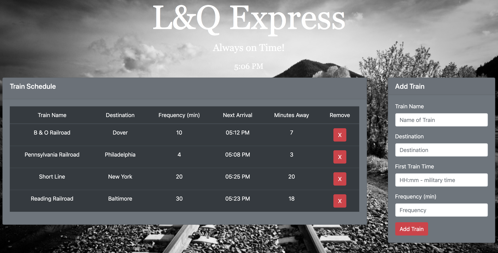

# TrainScheduler

### About my App:

This app is a Firebase-backed train scheduler.  It uses Firebase to host a globally available set of data that will be retrieved and manipulated using Moment.js to provide up-to-date information about the arrival times and minutes until arrival of various trains that the user inputs. 

### How my App Works

* It accepts user input to add new train name, start time, destination, frequency to figure out next arrival time and how many minutes the train will arrive.
* It displays schedule in a repeating table with new arrival times based on current time and frequency of trains stops.
* It stores train information in Firebase for data presistance and retrieves information from database on reload.
* The train schedule refreshes every minute to reflect updated arrival information.
* Th user can delete train information from schedule and database with a click of a button.

### Technologies Used for this App:

* Bootstrap,
* Moment.js,
* Firebase, and
* jQuery

### Thank you for visiting my GitHub!  
Enjoy using my app here: https://lucyq19.github.io/trainScheduler/

If you like this app, you may enjoy using more of my apps here: https://lucyq19.github.io/professionalPortfolio/